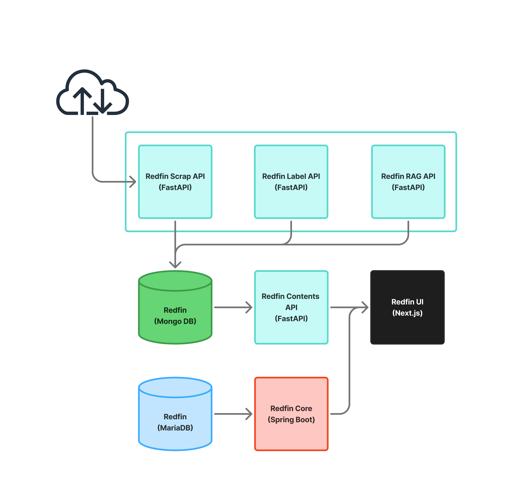

# AI 산업 RSS 뉴스 큐레이션 서비스

AI 산업 동향을 최소한의 노력으로 파악할 수 있는 맞춤형 뉴스 추천 서비스입니다.<br>
사용자는 RSS 기반의 다양한 뉴스 소스를 한 곳에서 확인하고,<br>
LLM 기반 인사이트·요약 기능을 통해 보다 빠르게 트렌드를 이해할 수 있습니다.

주요 기능은 아래와 같습니다.
```
1. 맞춤형 RSS 뉴스 추천 
2. 챗봇 기반 맞춤형 트렌드 인사이트
3. RAG 기반 뉴스 요약 및 검색
```
향후 확장 기능
```
단위 기간별 트렌드 인사이트 자동 생성 (RAG 기반 트렌드 리포트)
```

# 시연 영상
[데모 영상](https://www.youtube.com/watch?v=DE5MPjQ2H_I)
위의 링크를 누르시면 시연 영상을 볼 수 있습니다.

# 프로젝트 구성
Frontend
- [redfin_ui](https://github.com/team-spark-code/redfin_ui): Next.js 기반 개인 맞춤형 뉴스 피드 UI

Backend / Core Services
- [redfin_core](https://github.com/team-spark-code/redfin_core): Spring Boot 기반 인증/사용자 콘텐츠 관리 서비스
- [redfin_api](https://github.com/team-spark-code/redfin_api): 전처리된 뉴스 데이터를 제공하는 FastAPI 서비스

Data Collection / ETL
- [redfin_scrap_api](https://github.com/team-spark-code/redfin_scrap_api): RSS 수집 및 기사 크롤링 API
- [redfin_airflow](https://github.com/team-spark-code/redfin_airflow): ETL 스케줄링 파이프라인

AI / NLP
- [redfin_label_api](https://github.com/team-spark-code/redfin_label_api): 키워드 추출 및 카테고리 분류 모델 제공 API
- [redfin_rag](https://github.com/team-spark-code/redfin_rag): RAG 기반 뉴스 요약/질의응답 서비스

Infra
- [redfin_infra](https://github.com/team-spark-code/redfin_infra): MariaDB, MongoDB, Elasticsearch, Airflow 등 인프라 구성

기술 스택은 아래와 같습니다.
```
Frontend: Next.js, TypeScript, TailwindCSS  
Backend: Spring Boot, FastAPI  

AI/ML: HuggingFace, SentenceTransformer, LangChain, Ollama  

Data/Infra: MariaDB, MongoDB, Elasticsearch, ChromaDB  
ETL/DevOps: Airflow, Docker Compose, Bash  
Scraping: feedparser, scrapy  
```

# 시스템 구성


# 팀 소개
- 우성민(프로젝트 총괄)
    - 기획, 산출물 관리
    - 인프라/애플리케이션 설계 및 구현
    - ETL 파이프라인 API 개발
- 서익희(프로젝트 리더)
    - 일정 관리
    - 회원가입, 개인별 콘텐츠 관리 기능 개발
- 강충원 (LLM 개발)
    - RAG 기반 서비스 고도화
    - 프롬프트 엔지니어링 
- 김승환 (추천 시스템 개발)
    - ETL 파이프라인 전처리 로직 구현
    - Elasticsearch 기반 콘텐츠 추천 알고리즘 개발
- 정회성 (FE/BE 개발)
    - 메인 페이지 및 상세 페이지 UI 개발
    - LLM 튜닝 보조

# 참고자료
### [프로젝트 보고서](https://docs.google.com/presentation/d/18YM5UBKSPUVFEgYoLb2qJ9IpfbK4b7eU/edit?usp=sharing&ouid=116180314530610093024&rtpof=true&sd=true)
### [프로젝트 보고서(별첨)](https://docs.google.com/presentation/d/18YhOz2jKubgo4qoq2XnblXzUaMaS4kPa/edit?usp=sharing&ouid=116180314530610093024&rtpof=true&sd=true)
